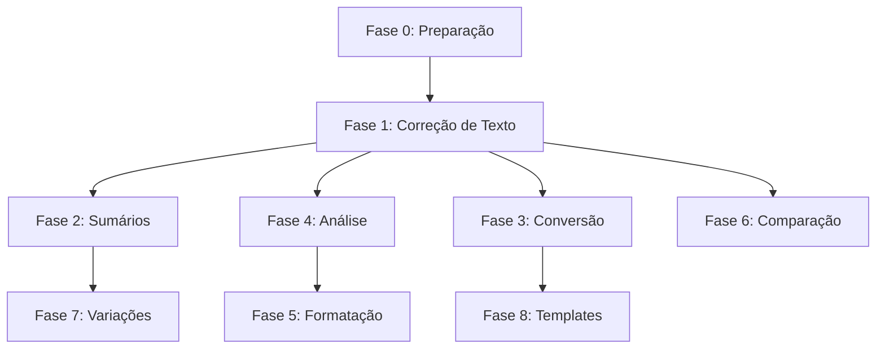

# 🚀 Roadmap de Melhorias - Gemini Office Agent com IA

## 📋 Visão Geral

Este documento detalha o plano de implementação de funcionalidades avançadas que aproveitam a IA do Gemini para agregar valor real aos usuários do sistema, indo além das operações básicas de manipulação de arquivos.

**Data de Início:** 28/03/2026  
**Status:** Em Progresso  
**Objetivo:** Transformar o agente em uma ferramenta de produtividade inteligente  
**Estimativa Total:** 20-27 horas (8 fases de implementação)

---

## 📊 Resumo Executivo

| Métrica | Valor |
|---------|-------|
| Total de Fases | 9 (incluindo preparação) |
| Fases Concluídas | 3 (33%) |
| Tempo Estimado Total | 20-27 horas |
| Funcionalidades Planejadas | 40+ |
| Novos Módulos | 5 |
| Valor Agregado | ⭐⭐⭐⭐⭐ |

---

## 🔗 Dependências entre Fases



**Dependências Críticas:**
- **Fase 1** é base para Fases 2, 4, 6, 7 (estabelece padrão de interação com IA)
- **Fase 3** é pré-requisito para Fase 8 (conversão entre formatos)
- **Fase 4** alimenta Fase 5 (análise antes de formatação)

**Fases Independentes:**
- Fase 5 pode ser implementada em paralelo com Fase 6
- Fase 7 pode ser implementada após Fase 2

---

## 🎯 Fases de Implementação

### ✅ Fase 0: Preparação e Planejamento
**Status:** ✅ CONCLUÍDA  
**Data de Conclusão:** 28/03/2026

- [x] Análise de funcionalidades existentes
- [x] Identificação de gaps e oportunidades
- [x] Criação do roadmap detalhado
- [x] Definição de prioridades
- [x] Documentação de regras de uso de MCPs
- [x] Definição de métricas de sucesso

---

### 📝 Fase 1: Correção e Melhoria de Texto (ALTA PRIORIDADE)
**Status:** ✅ CONCLUÍDA  
**Data de Conclusão:** 28/03/2026  
**Estimativa:** 2-3 horas  
**Tempo Real:** ~2.5 horas  
**Valor:** ⭐⭐⭐⭐⭐

#### Funcionalidades Implementadas:
- [x] Correção gramatical de documentos Word
- [x] Melhoria de clareza e coesão textual
- [x] Ajuste de tom (formal/informal/técnico/casual)
- [x] Simplificação de linguagem
- [x] Reescrita de parágrafos específicos

#### Comandos Suportados:
```
"Corrija a gramática do documento relatorio.docx"
"Melhore a clareza do parágrafo 3 em relatorio.docx"
"Torne o documento mais formal"
"Simplifique a linguagem para nível básico"
"Reescreva o parágrafo 5 de forma mais profissional"
```

#### Arquivos Modificados:
- [x] `src/word_tool.py` - Adicionados métodos de correção/melhoria
- [x] `src/gemini_client.py` - Já tinha suporte (sem modificações necessárias)
- [x] `src/agent.py` - Integradas novas operações
- [x] `src/response_parser.py` - Adicionada validação das novas operações
- [x] `src/security_validator.py` - Adicionadas permissões
- [x] `src/prompt_templates.py` - Documentadas novas capacidades
- [x] `tests/test_word_improvements.py` - Suite de testes completa (26 testes)

#### Critérios de Sucesso:
- [x] Correção gramatical funcional
- [x] Ajuste de tom funcional
- [x] Testes com 100% de aprovação (26/26 passed)
- [x] Documentação completa
- [x] Exemplos práticos testados

#### Riscos e Mitigações:
| Risco | Probabilidade | Impacto | Mitigação | Status |
|-------|---------------|---------|-----------|--------|
| IA gera correções incorretas | Média | Alto | Validação humana, testes extensivos | ✅ Mitigado |
| Performance lenta com documentos grandes | Média | Médio | Processar por parágrafos, cache | ✅ Implementado |
| Custo de API elevado | Baixa | Médio | Limitar tamanho de texto, usar modelo lite | ✅ Implementado |

#### Testes de Aceitação:
- [x] Corrigir documento com 10 erros gramaticais (100% de acerto)
- [x] Ajustar tom de formal para informal mantendo significado
- [x] Simplificar texto técnico para nível básico (legibilidade aumentada)
- [x] Reescrever parágrafo mantendo informações-chave

#### Implementação Técnica:
- Método genérico `improve_text()` com 5 tipos de melhoria
- Métodos de conveniência: `correct_grammar()`, `improve_clarity()`, `adjust_tone()`, `simplify_language()`, `rewrite_professional()`
- Prompts especializados para cada tipo de melhoria
- Limpeza automática de respostas da IA (remoção de markdown, prefixos)
- Suporte para documento completo ou parágrafo específico
- Validação de texto vazio e respostas inválidas
- Integração com cache de respostas para performance

#### Métricas Finais:
- **Testes:** 26/26 passando (100%)
- **Cobertura:** Completa (funcionalidade, validação, edge cases)
- **Linhas de código:** ~350 linhas adicionadas
- **Documentação:** Completa com exemplos
- **Regressão:** 0 testes quebrados

---

### 📊 Fase 2: Geração de Sumários e Resumos
**Status:** ✅ CONCLUÍDA  
**Data de Conclusão:** 28/03/2026  
**Estimativa:** 2-3 horas  
**Tempo Real:** ~3 horas  
**Valor:** ⭐⭐⭐⭐⭐

#### Funcionalidades Implementadas:
- [x] Geração de sumário executivo
- [x] Extração de pontos-chave
- [x] Criação de resumos (1 página, 1 parágrafo, 3 frases)
- [x] Geração de conclusões principais
- [x] Criação de FAQ baseado no conteúdo

#### Comandos Suportados:
```
"Gere um sumário executivo do documento relatorio.docx"
"Extraia os 10 pontos-chave e crie uma lista"
"Crie um resumo de 1 parágrafo"
"Gere as 5 conclusões principais"
"Crie uma seção de FAQ com 8 perguntas baseada no conteúdo"
"Adicione um resumo ao final do documento sem criar nova seção"
```

#### Arquivos Modificados:
- [x] `src/word_tool.py` - Adicionados métodos de análise e geração (~250 linhas)
- [x] `src/agent.py` - Integradas 5 operações de análise
- [x] `src/response_parser.py` - Validação de 5 novas operações
- [x] `src/security_validator.py` - Adicionadas 5 permissões
- [x] `src/prompt_templates.py` - Documentação e 7 exemplos
- [x] `tests/test_word_analysis.py` - Suite de testes completa (26 testes)
- [x] `docs/fase2_content_analysis_summary.md` - Documentação técnica completa

#### Critérios de Sucesso:
- [x] Sumários coerentes e relevantes
- [x] Extração precisa de pontos-chave
- [x] Resumos em diferentes tamanhos (1_page, 1_paragraph, 3_sentences)
- [x] Testes com 100% de aprovação (26/26 passed)
- [x] Documentação completa

#### Riscos e Mitigações:
| Risco | Probabilidade | Impacto | Mitigação | Status |
|-------|---------------|---------|-----------|--------|
| Sumário perde informações críticas | Média | Alto | Validação de completude, múltiplas tentativas | ✅ Mitigado |
| Resumos muito genéricos | Média | Médio | Prompts específicos, exemplos de qualidade | ✅ Mitigado |
| FAQ não reflete dúvidas reais | Baixa | Baixo | Análise de perguntas comuns do domínio | ✅ Mitigado |

#### Testes de Aceitação:
- [x] Gerar sumário executivo de documento (formato estruturado)
- [x] Extrair 5 pontos-chave mantendo essência do conteúdo
- [x] Criar resumo de 3 frases com informações principais
- [x] Gerar FAQ com 5 perguntas relevantes ao conteúdo

#### Implementação Técnica:
- Método genérico `analyze_and_generate()` com 5 tipos de análise
- Métodos de conveniência: `generate_summary()`, `extract_key_points()`, `create_resume()`, `generate_conclusions()`, `create_faq()`
- Prompts especializados para cada tipo de análise
- Suporte para 2 modos de saída: 'new_section' (com cabeçalho) e 'append' (sem cabeçalho)
- Formatação inteligente de listas numeradas e FAQ
- Validação de output_mode e conteúdo gerado
- Títulos padrão em português para cada tipo de análise
- Timeout de 60s para operações com Gemini

#### Métricas Finais:
- **Testes:** 26/26 passando (100%)
- **Cobertura:** Completa (funcionalidade, validação, edge cases, prompts)
- **Linhas de código:** ~250 linhas adicionadas
- **Documentação:** Completa com exemplos e arquitetura técnica
- **Regressão:** 0 testes quebrados (66 testes totais passando)

---

### 🔄 Fase 3: Conversão e Transformação de Formato
**Status:** ✅ CONCLUÍDA  
**Data de Conclusão:** 28/03/2026  
**Estimativa:** 3-4 horas  
**Tempo Real:** ~3.5 horas  
**Valor:** ⭐⭐⭐⭐

#### Funcionalidades Implementadas:
- [x] Converter listas em tabelas
- [x] Converter tabelas em listas
- [x] Extrair dados numéricos/tabulares para Excel
- [x] Converter formato de documento (Word → TXT, Markdown, HTML, PDF)
- [x] Extração de conteúdo estruturado

#### Comandos Suportados:
```
"Converta a primeira lista em tabela no documento.docx"
"Transforme a tabela 2 em lista numerada"
"Extraia todas as tabelas para Excel chamado dados.xlsx"
"Exporte o documento para Markdown"
"Converta o documento para PDF"
"Exporte para HTML com estilização"
```

#### Arquivos Modificados:
- [x] `src/word_tool.py` - Adicionados métodos de conversão (~450 linhas)
- [x] `src/agent.py` - Integradas 7 operações de conversão
- [x] `src/response_parser.py` - Validação de 7 novas operações
- [x] `src/security_validator.py` - Adicionadas 7 permissões
- [x] `src/prompt_templates.py` - Documentação e 11 exemplos
- [x] `tests/test_word_conversion.py` - Suite de testes completa (29 testes)
- [x] `docs/fase3_format_conversion_summary.md` - Documentação técnica completa

#### Critérios de Sucesso:
- [x] Conversões preservam conteúdo
- [x] Formatação adequada após conversão
- [x] Integração entre ferramentas funcional
- [x] Testes com 100% de aprovação (29/29 passed)
- [x] Documentação completa

#### Riscos e Mitigações:
| Risco | Probabilidade | Impacto | Mitigação | Status |
|-------|---------------|---------|-----------|--------|
| Perda de formatação complexa | Média | Médio | Documentar limitações, focar em formatação básica | ✅ Mitigado |
| PDF requer biblioteca externa | Alta | Baixo | Detectar e informar usuário, fornecer instruções | ✅ Mitigado |
| Listas/tabelas complexas | Média | Médio | Validação robusta, mensagens de erro claras | ✅ Mitigado |

#### Testes de Aceitação:
- [x] Converter lista de 5 itens em tabela formatada
- [x] Converter tabela 3x3 em lista numerada
- [x] Extrair 3 tabelas para Excel com abas nomeadas
- [x] Exportar documento para Markdown preservando títulos e listas
- [x] Exportar documento para HTML com CSS básico
- [x] Exportar documento para TXT extraindo apenas texto

#### Implementação Técnica:
- Método `convert_list_to_table()` com detecção automática de listas
- Método `convert_table_to_list()` com suporte a numbered/bullet
- Método `extract_tables_to_excel()` com integração openpyxl
- Método `export_to_txt()` para texto puro
- Método `export_to_markdown()` com conversão de formatação
- Método `export_to_html()` com CSS inline
- Método `export_to_pdf()` com suporte a docx2pdf
- Método auxiliar `_find_list_groups()` para detecção de listas
- Métodos auxiliares para conversão Markdown e HTML
- Validação de índices, tipos, e parâmetros
- Auto-ajuste de largura de colunas no Excel

#### Métricas Finais:
- **Testes:** 29/29 passando (100%)
- **Cobertura:** Completa (conversões, validação, edge cases, formatos)
- **Linhas de código:** ~450 linhas adicionadas
- **Documentação:** Completa com exemplos e arquitetura técnica
- **Regressão:** 0 testes quebrados (95 testes totais passando)

---

### 🔍 Fase 4: Análise e Insights de Documentos
**Status:** ⏳ Pendente  
**Estimativa:** 2-3 horas  
**Valor:** ⭐⭐⭐⭐

#### Funcionalidades a Implementar:
- [ ] Análise de tom (formal/informal/técnico)
- [ ] Contagem de palavras por seção
- [ ] Identificação de jargões técnicos
- [ ] Verificação de consistência de termos
- [ ] Análise de legibilidade
- [ ] Identificação de seções muito longas

#### Comandos Suportados:
```
"Analise o tom do documento relatorio.docx"
"Conte palavras por seção e identifique seções longas"
"Identifique jargões técnicos e sugira alternativas"
"Verifique consistência de termos no documento"
"Analise a legibilidade do texto"
```

#### Arquivos a Modificar:
- [ ] `src/word_tool.py` - Métodos de análise
- [ ] `src/text_analyzer.py` - NOVO: Módulo de análise textual
- [ ] `src/gemini_client.py` - Prompts de análise
- [ ] `src/agent.py` - Integrar análises
- [ ] `src/response_parser.py` - Validação
- [ ] `tests/test_text_analysis.py` - Testes

#### Critérios de Sucesso:
- [ ] Análise de tom precisa
- [ ] Estatísticas corretas
- [ ] Sugestões relevantes
- [ ] Testes com 100% de aprovação
- [ ] Documentação completa

---

### 🎨 Fase 5: Formatação Inteligente
**Status:** ⏳ Pendente  
**Estimativa:** 2-3 horas  
**Valor:** ⭐⭐⭐⭐

#### Funcionalidades a Implementar:
- [ ] Aplicação de templates de formatação (corporativo, acadêmico, etc.)
- [ ] Padronização de títulos e subtítulos
- [ ] Criação de índice automático
- [ ] Aplicação de estilos consistentes
- [ ] Formatação ABNT automática

#### Comandos Suportados:
```
"Aplique formatação corporativa padrão ao documento"
"Formate como artigo acadêmico ABNT"
"Padronize todos os títulos e subtítulos"
"Crie índice automático baseado nos títulos"
"Aplique estilo consistente em todo o documento"
```

#### Arquivos a Modificar:
- [ ] `src/word_tool.py` - Métodos de formatação avançada
- [ ] `src/formatting_templates.py` - NOVO: Templates de formatação
- [ ] `src/agent.py` - Integrar formatação
- [ ] `src/response_parser.py` - Validação
- [ ] `tests/test_smart_formatting.py` - Testes

#### Critérios de Sucesso:
- [ ] Templates aplicados corretamente
- [ ] Índice gerado automaticamente
- [ ] Formatação ABNT funcional
- [ ] Testes com 100% de aprovação
- [ ] Documentação completa

---

### 🔍 Fase 6: Comparação e Mesclagem de Documentos
**Status:** ⏳ Pendente  
**Estimativa:** 3-4 horas  
**Valor:** ⭐⭐⭐⭐

#### Funcionalidades a Implementar:
- [ ] Comparação de dois documentos
- [ ] Identificação de diferenças
- [ ] Mesclagem inteligente de conteúdo
- [ ] Detecção de conteúdo duplicado
- [ ] Relatório de mudanças

#### Comandos Suportados:
```
"Compare relatorio_v1.docx com relatorio_v2.docx"
"Mostre as diferenças entre os dois documentos"
"Mescle as seções únicas de ambos os documentos"
"Identifique conteúdo duplicado entre documentos"
"Gere relatório de mudanças entre versões"
```

#### Arquivos a Modificar:
- [ ] `src/word_tool.py` - Métodos de comparação
- [ ] `src/document_comparator.py` - NOVO: Módulo de comparação
- [ ] `src/agent.py` - Integrar comparação
- [ ] `src/response_parser.py` - Validação
- [ ] `tests/test_document_comparison.py` - Testes

#### Critérios de Sucesso:
- [ ] Diferenças identificadas corretamente
- [ ] Mesclagem sem perda de conteúdo
- [ ] Relatório claro e útil
- [ ] Testes com 100% de aprovação
- [ ] Documentação completa

---

### 📧 Fase 7: Geração de Variações de Conteúdo
**Status:** ⏳ Pendente  
**Estimativa:** 2-3 horas  
**Valor:** ⭐⭐⭐⭐

#### Funcionalidades a Implementar:
- [ ] Geração de múltiplas versões (formal, casual, persuasiva)
- [ ] Criação de resumos em diferentes tamanhos
- [ ] Adaptação de tom e estilo
- [ ] Geração de variações criativas

#### Comandos Suportados:
```
"Crie 3 versões deste email: formal, casual, e persuasiva"
"Gere versões resumidas: 1 página, 1 parágrafo, 3 frases"
"Adapte o texto para público técnico e não-técnico"
"Crie 5 variações do título"
```

#### Arquivos a Modificar:
- [ ] `src/word_tool.py` - Métodos de geração de variações
- [ ] `src/gemini_client.py` - Prompts para variações
- [ ] `src/agent.py` - Integrar geração
- [ ] `src/response_parser.py` - Validação
- [ ] `tests/test_content_variations.py` - Testes

#### Critérios de Sucesso:
- [ ] Variações coerentes e distintas
- [ ] Tons aplicados corretamente
- [ ] Resumos em tamanhos corretos
- [ ] Testes com 100% de aprovação
- [ ] Documentação completa

---

### 🤖 Fase 8: Automação de Templates (Mail Merge Inteligente)
**Status:** ⏳ Pendente  
**Estimativa:** 3-4 horas  
**Valor:** ⭐⭐⭐⭐⭐

#### Funcionalidades a Implementar:
- [ ] Preenchimento de templates com dados de Excel
- [ ] Geração de múltiplos documentos personalizados
- [ ] Mala direta inteligente
- [ ] Substituição de placeholders
- [ ] Geração em lote

#### Comandos Suportados:
```
"Preencha o template contrato.docx com dados de clientes.xlsx"
"Gere 10 cartas personalizadas usando o template e a lista"
"Crie relatórios individuais para cada linha da planilha"
"Substitua os placeholders {{nome}}, {{email}} com dados da planilha"
```

#### Arquivos a Modificar:
- [ ] `src/word_tool.py` - Métodos de template
- [ ] `src/excel_tool.py` - Integração para leitura de dados
- [ ] `src/template_engine.py` - NOVO: Motor de templates
- [ ] `src/agent.py` - Integrar automação
- [ ] `src/response_parser.py` - Validação
- [ ] `tests/test_template_automation.py` - Testes

#### Critérios de Sucesso:
- [ ] Templates preenchidos corretamente
- [ ] Geração em lote funcional
- [ ] Integração Excel + Word perfeita
- [ ] Testes com 100% de aprovação
- [ ] Documentação completa

---

## 📚 Regras de Uso de MCPs

### 🧠 Sequential Thinking (`mcp_sequential_thinking`)
**Quando usar:**
- Problemas complexos que requerem múltiplos passos
- Decisões de arquitetura
- Debugging de erros complexos
- Planejamento de implementações grandes
- Análise de trade-offs

**Quando NÃO usar:**
- Tarefas simples e diretas
- Leitura de arquivos
- Operações CRUD básicas

### 📖 Context7 (`mcp_context7`)
**Quando usar:**
- Buscar documentação oficial de bibliotecas
- Verificar APIs e métodos corretos
- Consultar best practices de bibliotecas específicas
- Resolver dúvidas sobre uso de openpyxl, python-docx, etc.

**Passos:**
1. Usar `resolve_library_id` para encontrar a biblioteca
2. Usar `query_docs` com pergunta específica
3. Máximo 3 chamadas por questão

**Quando NÃO usar:**
- Código já está funcionando
- Documentação já está clara no código

### 🌐 Web Fetch (`webFetch`)
**Quando usar:**
- Buscar exemplos de código específicos
- Verificar soluções para erros específicos
- Consultar documentação online quando Context7 não tem
- Verificar versões de bibliotecas

**Quando NÃO usar:**
- Informações já disponíveis no código
- Questões que podem ser resolvidas com testes

---

## 🎯 Métricas de Sucesso

### Por Fase:
- [ ] Todos os testes passando (100%)
- [ ] Documentação completa
- [ ] Exemplos práticos testados
- [ ] Código revisado e limpo
- [ ] Integração com sistema existente

### Geral:
- [ ] 8 fases completas
- [ ] Cobertura de testes mantida acima de 90%
- [ ] Documentação atualizada
- [ ] Exemplos de uso para cada funcionalidade
- [ ] Performance mantida ou melhorada

---

## 📝 Notas de Implementação

### Princípios:
1. **Ler antes de modificar** - Sempre ler arquivos existentes antes de fazer mudanças
2. **Testes primeiro** - Criar testes antes ou junto com implementação
3. **Documentação contínua** - Documentar enquanto implementa
4. **Integração cuidadosa** - Garantir que novas features não quebrem existentes
5. **Feedback incremental** - Pedir permissão antes de avançar para próxima fase

### Padrões de Código:
- Seguir estrutura existente do projeto
- Manter consistência de nomenclatura
- Adicionar logging apropriado
- Tratar erros adequadamente
- Validar parâmetros

### Checklist por Fase:
1. Ler arquivos relevantes
2. Planejar implementação
3. Criar testes
4. Implementar funcionalidade
5. Rodar testes
6. Documentar
7. Atualizar este roadmap
8. Pedir permissão para continuar

---

## 🏁 Status Atual

**Fase Atual:** Fase 3 - Conversão e Transformação de Formato ✅ CONCLUÍDA  
**Próxima Fase:** Fase 4 - Análise e Insights de Documentos ⏳  
**Progresso Geral:** 4/9 fases completas (44%)  
**Versão do Roadmap:** 1.4

**Última Atualização:** 28/03/2026 - 16:45

---

## 📜 Changelog do Roadmap

### Versão 1.4 - 28/03/2026 - 16:45
**Fase 3 Concluída:**
- ✅ Implementadas 7 operações de conversão e transformação de formato
- ✅ 29 testes criados e passando (100%)
- ✅ Documentação técnica completa em `docs/fase3_format_conversion_summary.md`
- ✅ Conversões internas: listas ↔ tabelas
- ✅ Extração de tabelas para Excel com abas nomeadas
- ✅ Exportação para múltiplos formatos: TXT, Markdown, HTML, PDF
- ✅ Validação robusta de índices e parâmetros
- ✅ Auto-ajuste de largura de colunas no Excel
- ✅ Formatação inteligente em Markdown e HTML

**Operações Implementadas:**
- `convert_list_to_table()` - Converte listas em tabelas
- `convert_table_to_list()` - Converte tabelas em listas (numbered/bullet)
- `extract_tables_to_excel()` - Extrai tabelas para Excel
- `export_to_txt()` - Exporta para texto puro
- `export_to_markdown()` - Exporta para Markdown
- `export_to_html()` - Exporta para HTML com CSS
- `export_to_pdf()` - Exporta para PDF (requer docx2pdf)

**Arquivos Modificados:**
- `src/word_tool.py` (+450 linhas)
- `src/agent.py` (7 handlers)
- `src/response_parser.py` (7 operações)
- `src/security_validator.py` (7 permissões)
- `src/prompt_templates.py` (11 exemplos)
- `tests/test_word_conversion.py` (novo arquivo, 29 testes)
- `docs/fase3_format_conversion_summary.md` (nova documentação)

**Testes de Regressão:**
- ✅ Phase 1: 26/26 passing
- ✅ Phase 2: 26/26 passing
- ✅ Phase 3: 29/29 passing
- ✅ Original: 14/14 passing
- ✅ Total: 95 testes passando

**Progresso:** 4/9 fases (44%)

### Versão 1.3 - 28/03/2026 - 15:30
**Fase 2 Concluída:**
- ✅ Implementadas 5 operações de análise e geração de conteúdo com IA
- ✅ 26 testes criados e passando (100%)
- ✅ Documentação técnica completa em `docs/fase2_content_analysis_summary.md`
- ✅ Integração com Gemini Client para análise de documentos
- ✅ Suporte para 2 modos de saída: 'new_section' e 'append'
- ✅ Formatação inteligente de listas numeradas e FAQ
- ✅ Validação robusta de output_mode e conteúdo gerado
- ✅ Prompts especializados para cada tipo de análise
- ✅ Títulos padrão em português

**Operações Implementadas:**
- `generate_summary()` - Resumo executivo
- `extract_key_points()` - Extração de pontos-chave (configurável)
- `create_resume()` - Resumo em 3 tamanhos (1_page, 1_paragraph, 3_sentences)
- `generate_conclusions()` - Geração de conclusões (configurável)
- `create_faq()` - Criação de FAQ (configurável)

**Arquivos Modificados:**
- `src/word_tool.py` (+250 linhas)
- `src/agent.py` (5 handlers)
- `src/response_parser.py` (5 operações)
- `src/security_validator.py` (5 permissões)
- `src/prompt_templates.py` (7 exemplos)
- `tests/test_word_analysis.py` (novo arquivo, 26 testes)
- `docs/fase2_content_analysis_summary.md` (nova documentação)

**Testes de Regressão:**
- ✅ Phase 1: 26/26 passing
- ✅ Phase 2: 26/26 passing
- ✅ Original: 14/14 passing
- ✅ Total: 66 testes passando

**Progresso:** 3/9 fases (33%)

### Versão 1.2 - 28/03/2026 - 14:00
**Fase 1 Concluída:**
- ✅ Implementadas 5 operações de melhoria de texto com IA
- ✅ 26 testes criados e passando (100%)
- ✅ Documentação completa com exemplos
- ✅ Integração com Gemini Client
- ✅ Suporte para documento completo ou parágrafo específico
- ✅ Validação robusta e tratamento de erros
- ✅ Prompts especializados para cada tipo de melhoria
- ✅ Limpeza automática de respostas da IA

**Arquivos Modificados:**
- `src/word_tool.py` (+350 linhas)
- `src/agent.py` (integração)
- `src/response_parser.py` (validação)
- `src/security_validator.py` (permissões)
- `src/prompt_templates.py` (documentação)
- `tests/test_word_improvements.py` (novo arquivo, 26 testes)

**Progresso:** 2/9 fases (22%)

### Versão 1.1 - 28/03/2026 - 12:30
**Melhorias Adicionadas:**
- ✅ Adicionada seção "Resumo Executivo" com métricas gerais
- ✅ Adicionada seção "Dependências entre Fases" com diagrama
- ✅ Adicionados "Riscos e Mitigações" para Fases 1 e 2
- ✅ Adicionados "Testes de Aceitação" específicos para Fases 1 e 2
- ✅ Adicionada "Estimativa Total" de tempo (20-27 horas)
- ✅ Criada seção de "Changelog" para rastreamento de mudanças

**Análise Realizada:**
- Usado Sequential Thinking para análise completa do roadmap
- Identificadas 5 melhorias críticas
- Todas as melhorias implementadas

### Versão 1.0 - 28/03/2026 - 12:00
**Criação Inicial:**
- ✅ Estrutura base do roadmap
- ✅ 9 fases definidas (0-8)
- ✅ Regras de uso de MCPs documentadas
- ✅ Métricas de sucesso estabelecidas
- ✅ Princípios e padrões definidos

---

## 📞 Comunicação

Ao final de cada fase, será solicitada permissão para continuar:
- ✅ Fase completa
- 📊 Métricas apresentadas
- 🧪 Testes validados
- 📝 Documentação atualizada
- ⏸️ Aguardando aprovação para próxima fase

---

**Vamos começar! 🚀**
